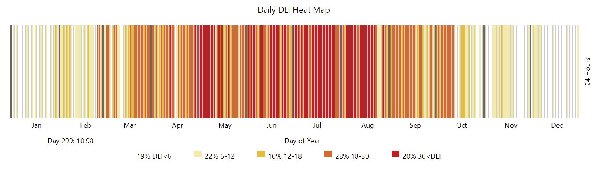
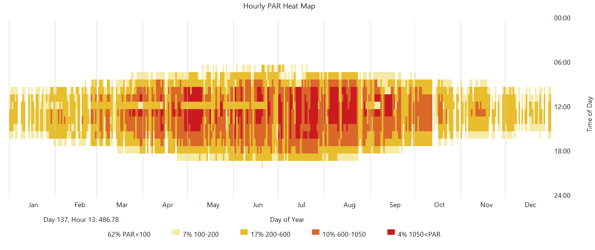
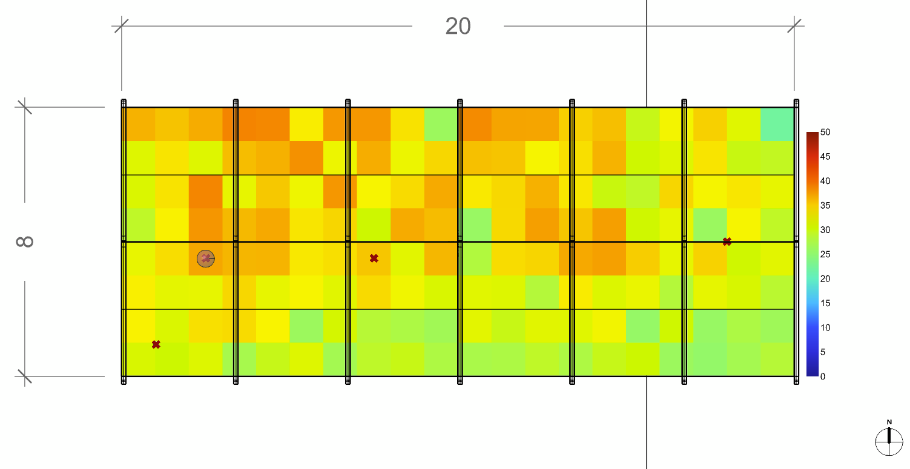
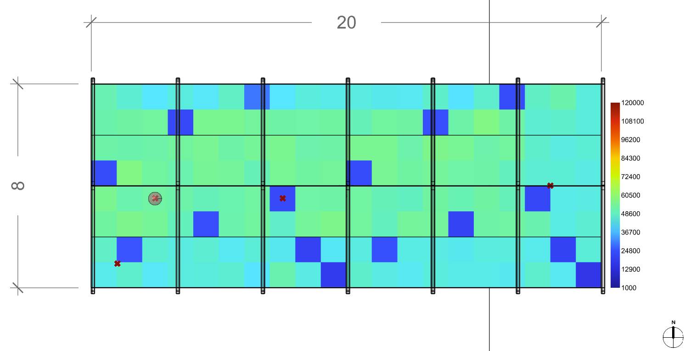
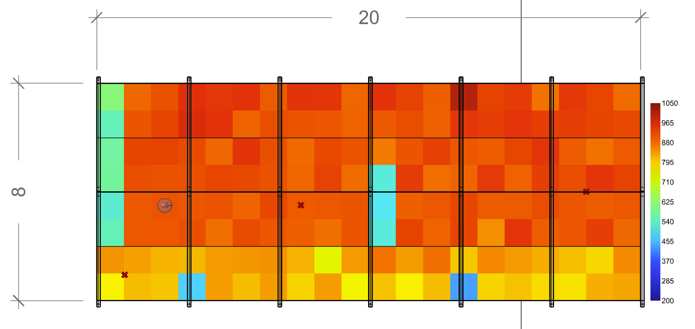
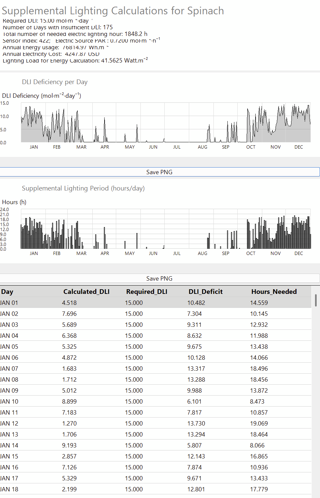

# Kybele

Kybele is a Rhino–Grasshopper plugin for Radiance-based daylight and electric lighting simulation, spectral and hyperspectral lighting data integration, and plant growth prediction.

## Overview
Kybele supports performance-driven greenhouse and controlled-environment design workflows by computing lighting metrics from both daylight and electric lighting across three-channel and hyperspectral domains.

## Sample Outputs

### Annual DLI Heatmap

### Hourly Annual PAR

### DLI on June 21st

### Point-in-Time Illuminance

### Point-in-Time PAR

### Plant Growth Prediction

## Features

### Three-Channel (RGB) Lighting Analysis
- Point-in-time illuminance
- Annual illuminance
- Photosynthetically Active Radiation (PAR)
- Daily Light Integral (DLI)
- Electric lighting analysis
- Combined daylight and electric lighting analysis
- Luminance-based renderings

### Spectral Utilities
- Spectral conversion factors for lighting and plant-growth workflows

### Hyperspectral Lighting Analysis
- Point-in-time illuminance
- Annual illuminance
- Electric lighting analysis
- Photosynthetically Active Radiation (PAR)
- Daily Light Integral (DLI)
- Luminance-based renderings

## Status
**Beta release (v0.0.1)** — research and academic use.
